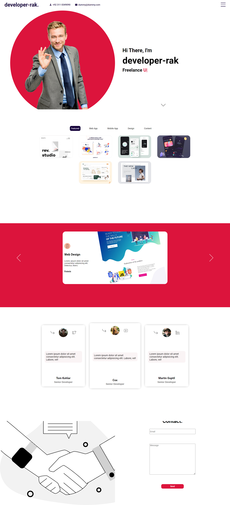

# :closed_book: Portfolio

### _react portfolio website !!_

### Link :link: https://rak-react-portfolio.netlify.app/

## Interface

## Run Locally

  - Run This command `https://github.com/developer-rak/portfolio.git`
  - You are now in the dev environment and you can play around

## ✨ Features

  - SideBar Navigation Menu
  - Home
  - Portfolio
  - Works
  - Testimonials
  - Contact

## ⚙️ Tech Stack
  - HTML5
  - SASS
  - Mui Material UI
  - Mui Icons
  - ityped
  - React
  - Netlify
